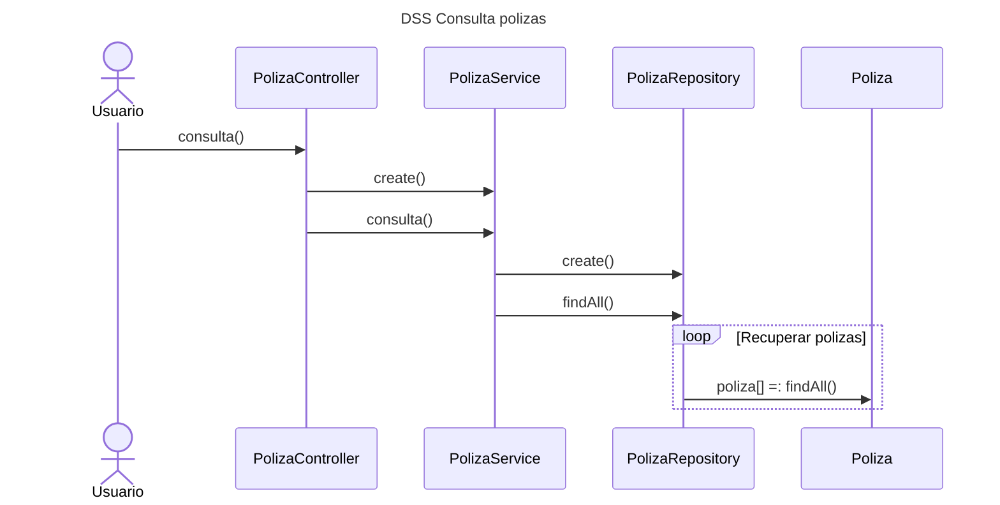
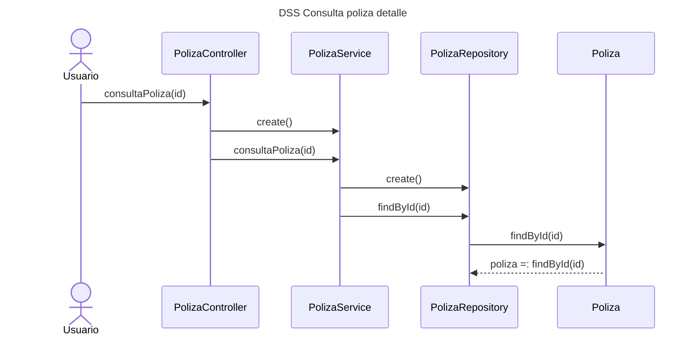
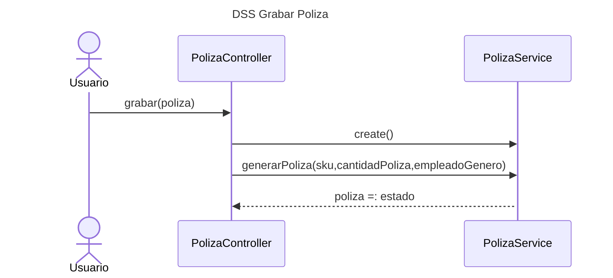
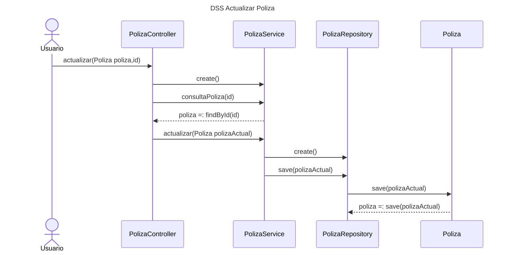
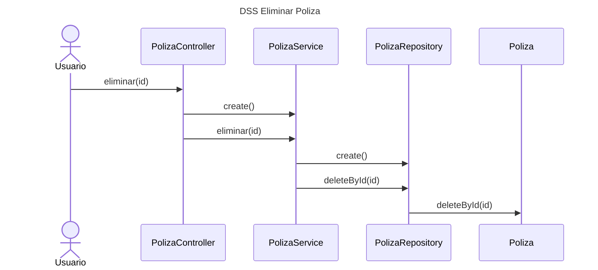

# ApiRestFul
CRUD de api's

```mermaid 
---
title: DSS Consulta polizas
---
sequenceDiagram
actor Usuario
participant PolizaController
participant PolizaService
participant PolizaRepository
participant Poliza


Usuario->>PolizaController: consulta()
PolizaController->>PolizaService: create()
PolizaController->>PolizaService: consulta()
PolizaService->>PolizaRepository: create()
PolizaService->>PolizaRepository: findAll()

loop Recuperar polizas
    PolizaRepository->>Poliza: poliza[] =: findAll()
end

```

```mermaid 
---
title: DSS Consulta poliza detalle
---
sequenceDiagram
actor Usuario
participant PolizaController
participant PolizaService
participant PolizaRepository
participant Poliza

Usuario->>PolizaController: consultaPoliza(id)
PolizaController->>PolizaService: create()
PolizaController->>PolizaService: consultaPoliza(id)
PolizaService->>PolizaRepository: create()
PolizaService->>PolizaRepository: findById(id)
PolizaRepository->>Poliza: findById(id)
activate Poliza
Poliza-->>PolizaRepository: poliza =: findById(id)

```

```mermaid 
---
---
title: DSS Grabar Poliza
---
sequenceDiagram
actor Usuario
participant PolizaController
participant PolizaService

Usuario->>PolizaController: grabar(poliza)
PolizaController->>PolizaService: create()
PolizaController->>PolizaService: generarPoliza(sku,cantidadPoliza,empleadoGenero)
activate PolizaService
PolizaService-->>PolizaController: poliza =: estado
```

```mermaid 
---
---
title: DSS Actualizar Poliza
---
sequenceDiagram
actor Usuario
participant PolizaController
participant PolizaService
participant PolizaRepository
participant Poliza

Usuario->>PolizaController: actualizar(Poliza poliza,id)
PolizaController->>PolizaService: create()
PolizaController->>PolizaService: consultaPoliza(id)
PolizaService-->>PolizaController: poliza =: findById(id)
PolizaController->>PolizaService: actualizar(Poliza polizaActual)
PolizaService->>PolizaRepository: create()
PolizaService->>PolizaRepository: save(polizaActual)
PolizaRepository->>Poliza: save(polizaActual)
activate Poliza
Poliza-->>PolizaRepository: poliza =: save(polizaActual)
```

```mermaid 
---
---
title: DSS Eliminar Poliza
---
sequenceDiagram
actor Usuario
participant PolizaController
participant PolizaService
participant PolizaRepository
participant Poliza

Usuario->>PolizaController: eliminar(id)
PolizaController->>PolizaService: create()
PolizaController->>PolizaService: eliminar(id)
PolizaService->>PolizaRepository: create()
PolizaService->>PolizaRepository: deleteById(id)
PolizaRepository->>Poliza: deleteById(id)
activate Poliza
```
